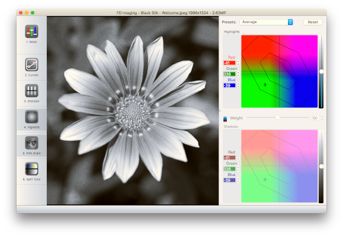

# Black Silk
Black Silk is an easy to use black and white toolkit.
You can modify your image with 6 filters:
* Mixer
* Curves
* Sharpen
* Vignette
* Film Grain
* Split Tone

## Screenshot

## Building
You need Qt 5.x and g++9 on Linux, Xcode 10/11 on macOS and Visual Studio 2019 on Windows.  
With the bash scripts in scripts, you can download and build the imagemagick dependency.  
Then you can open `qmake/libimagemagick.pro` to build the image loader plugin. Then you can open `qmake/blacksilk.pro` to build Black Silk itself.  
